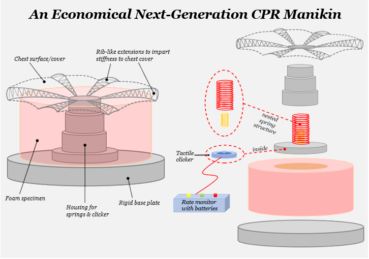

<h1 align="center">Bachelor's Thesis</h1>

**University:** IIT Kharagpur

**Location:** Kharagpur, India

**Duration:** Aug 2019 - Apr 2020

**Advisor:** Prof Atul Jain

**YouTube video:** ["Bachelor's Thesis"](https://youtu.be/w_XICuOc98Y)

---

***Project objective:*** *Design and development of an economical, next-generation CPR training manikin*

**My contributions:**
* Performed analytical and experimental stiffness calculations of springs, and also calculated their fatigue properties
* Studied the viscoelastic behavior of the human chest during a CPR process and compared them with my calculations, thus,
identifying the limitations of conventional manikin
* Used foams to impart damping characteristics to the manikin based on reliability, cost, and ease of assembly and repair
* Used an Indentation Force Deflection machine and a Sinusoidal Displacement Exciter to measure the dynamic properties, damping
coefficient, and transmissibility of a variety of foam specimens and select the appropriate one
* Designed a novel CPR manikin incorporating a nested spring structure, a foam casing, a chest cover with rib-like extensions, and a
tactile clicker together with a rate monitor to provide real-time compression depth and frequency feedback to the user
* The project was one of the 10 projects (top 5%) to be nominated for the Best Bachelor's Thesis award among ~200 projects

  

<em>Figure 1: Graphical abstract.</em>

